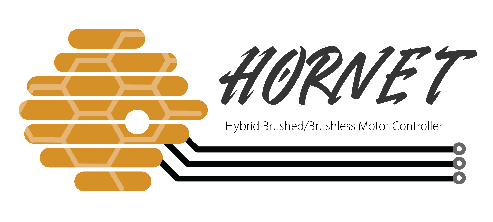

# Hornet Hybrid Brushed/Brushless Motor Controller

## 1.1 General Summary

The HORNET MOTOR CONTROLLER is a 5A/24V hybrid brushed and brushless motor controller designed for robotic applications.

## 1.2 Feature Overview
- Servo-style PWM control interface
- Quadrature Encoder Support
- RGB Status LED
- PIDf Motion Magic
- CAN, UART, and USB data interfaces
- Brake/Coast mode
